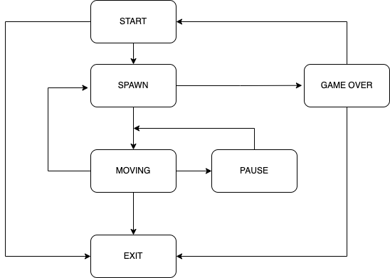
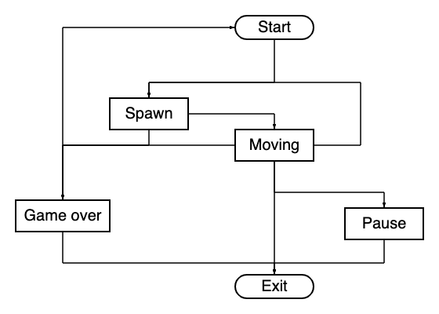

# 🕹️ Brick Game: Tetris & Snake

This project implements classic brick games: Tetris and Snake. 🧱💥🐍

## Installation

To install the game, follow these steps:

1. Navigate to the `src` directory.
2. Run the following commands:
   - To install both desktop and console versions: 
     ```bash
     make install
     ```
   - To install only the console version:
     ```bash
     make install_cli
     ```
   - To install only the desktop version:
     ```bash
     make install_desktop
     ```
   - To start the game in desktop mode:
     ```bash
     make run_desktop
     ```
   - To start the game in console mode:
     ```bash
     make run_cli
     ```
3. To uninstall, run:
   ```bash
   make uninstall


# 🎮 Tetris

## Finite State Machine Diagram



## Features

- Move blocks right, left, and down.
- Rotate blocks to fit into lines.
- Clear full lines when completed.
- 6 different types of blocks.
- Display the next block that will appear.
- Game over occurs when a block reaches the top of the game field.
- Game field size: **10x20**.

### Controls

- Exit: `0`
- Pause: `Spacebar`
- Move Right: `Right Arrow Key`
- Move Left: `Left Arrow Key`
- Drop Tetromino: `Down Arrow Key`

### Scoring and Leveling Up

Earn points for clearing full lines:

- **1 line cleared** - 100 points
- **2 lines cleared** - 300 points
- **3 lines cleared** - 700 points
- **4 lines cleared** - 1500 points

**Climb through the levels:**

- Earn **600 points** to achieve the next level.
- Maximum level: **10**.


# 🐍 Snake

## Finite State Machine Diagram



## Features

- Move in any direction to collect green apples.
- Avoid hitting borders or yourself.
- The snake starts with **4 red blocks**.
- Aim to achieve **200 points**.
- **10 levels** with varying speeds.

### Controls

- Exit: `0` in console or `Esc` in desktop.
- Pause: `Spacebar`
- Move Right: `Right Arrow Key`
- Move Left: `Left Arrow Key`
- Move Down: `Down Arrow Key`
- Move Up: `Up Arrow Key`

### Scoring and Leveling Up

Earn **5 points** to level up:
- Maximum level: **10**.

### Maximum Snake Size

Strive to achieve the maximum snake size of **200 blocks**!

### Record Keeping

The highest score is saved between game sessions for each game.
